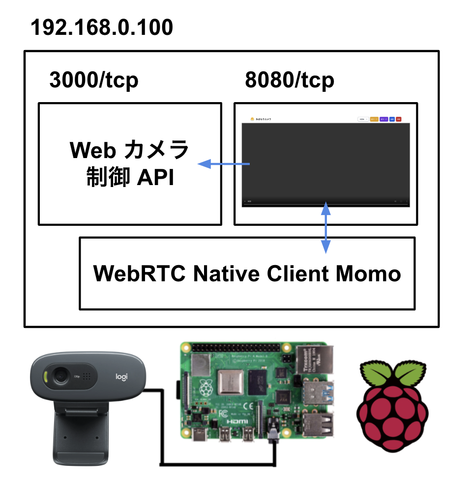

# mimamori

「mimamori」は赤ちゃんのための見守りカメラシステムです。  
Web カメラが捉えた映像と音声を WebRTC で配信し、ブラウザからストリーミングできるようにしています。


## 依存関係

- ハードウェア
  - [Raspberry Pi 4 Model B](https://www.raspberrypi.com/products/raspberry-pi-4-model-b/)
  - [Logicool C270n HD ウェブカメラ](https://www.logicool.co.jp/ja-jp/products/webcams/hd-webcam-c270n.960-001265.html)
- ソフトウェア
  - [WebRTC Native Client Momo](https://github.com/shiguredo/momo)

## システム構成図



## 導入手順

### 0 注意事項

1. Raspberry Pi に Raspberry Pi OS はインストール済みとします。
2. Raspberry Pi のローカル IP アドレスは「192.168.0.100」が割り当てられていることを前提としています。  
   環境に合わせて適宜読み替えてください。

### 1 WebRTC Native Client Momo の導入

次の 2 つの公式ドキュメントに従って、WebRTC Native Client Momo を Raspberry Pi に導入・動作確認します。

- [Raspberry Pi (Raspberry-Pi-OS) で Momo を使ってみる](https://github.com/shiguredo/momo/blob/develop/doc/SETUP_RASPBERRY_PI.md)
- [テストモードを利用して Momo を動かしてみる](https://github.com/shiguredo/momo/blob/develop/doc/USE_TEST.md)

WebRTC Native Client Momo のバイナリおよび関連ファイルは /home/pi/mimamori 下に展開しておきます。

### 2 Web カメラ制御 API サーバーの導入

mimamori-exec-server は次の 2 つの処理を外部から実行できるようにするための API サーバーです。

- カメラモード「昼」または「夜」の設定
  - [v4l2-utils](https://git.linuxtv.org/v4l-utils.git) に含まれる v4l2-ctl コマンドを使用して、Web カメラの設定を制御します。
- 画面キャプチャ
  - 手順 3 で後述する mimamori-capture-screen を実行します。

まず、v4l2-ctl コマンドを Raspberry Pi で使えるようにするため、次のコマンドを実行して v4l2-utils をインストールします。

```
pi@raspberrypi:~ $ sudo apt install v4l-utils
```

次に Raspberry Pi 向けにビルド済みの API サーバーのバイナリを scp で mac から Raspberry Pi に転送します。（[./backend/mimamori-exec-server/Makefile](./backend/mimamori-exec-server/Makefile) の scp の項目を参照ください。）

```
$ make scp
```

### 3 画面キャプチャスクリプトの導入

mimamori-capture-screen は Web カメラが捉えている画像を読み取り、LINE Notify を経由して指定したトークルームに画像を送信する Python スクリプトです。  
LINE Notify のアクセストークンの取得手順は割愛します。

まず、mimamori-capture-screen を scp で mac から Raspberry Pi に転送します。（[./scripts/mimamori-capture-screen/Makefile](./scripts/mimamori-capture-screen/Makefile) の scp の項目を参照ください。）

```
$ make scp
```

次に Python の依存関係モジュールを Raspberry Pi インストールします。（[./scripts/mimamori-capture-screen/Makefile](./scripts/mimamori-capture-screen/Makefile) の pip-install の項目を参照ください。）

```
pi@raspberrypi:~ $ make pip-install
```

最後に /home/pi/mimamori/mimamori-capture-screen 下に .env ファイルを作成し、LINE Notify のアクセストークンを LINE_NOTIFY_API_TOKEN に設定します。

```.env
LINE_NOTIFY_API_TOKEN=xxxxxxxxxx
```

### 4 Web Frontend の導入

この Web Frontend は WebRTC Native Client Momo が WebRTC で配信する映像と音声をストリーミングします。  
また、手順 2 で導入した API サーバーのクライアントとしても機能します。

手順 1 で導入した WebRTC Native Client Momo のバイナリを配置したディレクトリの html 下に [./frontend](./frontend/) のファイルを配置します。

### 5 v4l2loopback と FFmpeg によるビデオデバイスの多重化

Linux では、通常 1 台のウェブカメラ（Video4Linux デバイス）を複数のアプリケーション（mimamori では WebRTC Native Client Momo と mimamori-capture-screen）で同時に使うことはできないため、v4l2loopback で複数の仮想ビデオデバイスを作成し、FFmpeg で物理ビデオデバイスの映像を仮想ビデオデバイスに転送することで、この問題を回避します。

まず、v4l2loopback をインストールします。

```
pi@raspberrypi:~ $ sudo apt install v4l2loopback-dkms
```

次に、v4l2loopback で仮想ビデオデバイスを作成し、FFmpeg で物理ビデオデバイスの映像を仮想ビデオデバイスに転送するシェルスクリプトを scp で mac から Raspberry Pi に転送します。（[./scripts/ffmpeg-virtual-stream/Makefile](./scripts/ffmpeg-virtual-stream/Makefile) の scp の項目を参照ください。）  
このシェルスクリプトは Raspberry Pi を起動するたびに実行する必要があります。

```
$ make scp
```

シェルスクリプトには実行権限を付与しておきます。

```
pi@raspberrypi:~/mimamori $ chmod +x ffmpeg-virtual-stream.sh
```

作成される仮想ビデオデバイスの例

```
pi@raspberrypi:~ $ v4l2-ctl --list-devices

Dummy video device (0x0000) (platform:v4l2loopback-000):
	/dev/video2

Dummy video device (0x0001) (platform:v4l2loopback-001):
	/dev/video3
```

### 6 Systemd でサービス化

次の 3 つの Systemd のサービスを /etc/systemd/system 下に配置します。

- [/etc/systemd/system/mimamori-webrtc-server.service](./etc/systemd/system/mimamori-webrtc-server.service)
  - 手順 1 で導入した WebRTC Native Client Momo のバイナリを test モードで実行するサービス
- [/etc/systemd/system/mimamori-exec-server.service](./etc/systemd/system/mimamori-exec-server.service)
  - 手順 2 で導入した Web カメラ制御 API サーバーのバイナリを実行するサービス
  - 手順 3 で導入した mimamori-capture-screen を実行できるようにするため、実行ユーザーは pi を指定しています。
- [/etc/systemd/system/ffmpeg-virtual-stream.service](./etc/systemd/system/ffmpeg-virtual-stream.service)
  - 手順 5 で導入した ffmpeg-virtual-stream.sh を実行するサービス

次のコマンドを実行して、サービスを再読み込みします。

```
pi@raspberrypi:~ $ sudo systemctl daemon-reload
```

次のコマンドを実行して、OS の起動時にサービスが自動的に実行されるようにします。

```
pi@raspberrypi:~ $ sudo systemctl enable mimamori-webrtc-server.service
pi@raspberrypi:~ $ sudo systemctl enable mimamori-exec-server.service
pi@raspberrypi:~ $ sudo systemctl enable ffmpeg-virtual-stream.service
```

### 7 ディレクトリ構成の確認

最終的なディレクトリ構成は次のようになります。

Web Frontend と Backend

```
pi@raspberrypi:~/mimamori $ tree .
.
|-- html
|   |-- mimamori-exec-client.js
|   |-- favicon-96x96.png
|   |-- mimamori.html
|   `-- webrtc.js
|-- mimamori-capture-screen
|   |-- .env
|   |-- main.py
|   |-- Makefile
|   `-- requirements.txt
|-- ffmpeg-virtual-stream.sh
|-- mimamori-exec-server
`-- momo
```

Systemd のサービス

```
pi@raspberrypi:/etc/systemd/system $ ls
ffmpeg-virtual-stream.service
mimamori-webrtc-server.service
mimamori-exec-server.service
```

## 使い方

Raspberry Pi と同じローカルエリアネットワークに接続されているデバイスから http://192.168.0.100:8080/html/mimamori.html にアクセスします。  
画面右上「接続」ボタンを押して、ストリーミングを開始します。  
また、画面右上「昼モード」、「夜モード」ボタンを押して、カメラの設定を切り替えます。  
さらに、画面右上「画面キャプチャ」ボタンを押して、Web カメラの画像を指定した LINE のトークルームに送信します。
